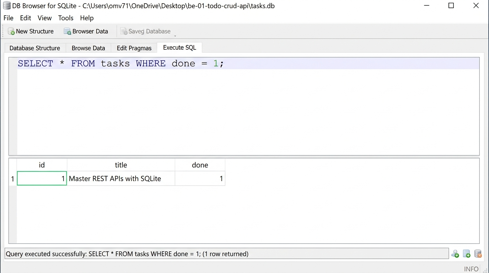

# BE-01 — Task CRUD API (Week 3: SQLite Database Integration)

Node.js + Express Task CRUD API backed by a persistent SQLite database using `better-sqlite3`.

---

## Why SQLite?
- **Lightweight & Embedded:** Zero-configuration, serverless database engine running directly within the Node.js process.
- **Single-File Storage:** The entire database resides in a single cross-platform file (`tasks.db`), eliminating the need to set up or manage a separate database server.
- **ACID Compliant & Fast:** Provides reliable transactions and persistence with WAL (Write-Ahead Logging) mode enabled.
- **Ideal for Assignment:** Perfect for self-contained, reproducible backend assignments and local development without cloud or container overhead.

---

## Database Configuration & Storage
- **File Location:** The database file is stored in the project root directory as `tasks.db`.
- **Automatic Initialization:** When the application starts, `db.js` automatically creates `tasks.db` and the `tasks` table if they do not exist.
- **One-Time Seeding:** If the database is newly created (empty), it automatically seeds exactly 3 initial tasks.
- **Persistence:** All task creations, updates, and deletions are committed to `tasks.db` and persist across application restarts.

---

## Getting Started

### Prerequisites
- Node.js (v18+)
- npm

### Installation & Run
```bash
# 1. Install dependencies
npm install

# 2. Start the application
npm start

# Or start in development mode with auto-reload
npm run dev
```

The API will be running at `http://localhost:3000`.

---

## API Documentation & Endpoints

Interactive Swagger UI documentation is available at:
**http://localhost:3000/docs**

### Endpoints
| Method | Endpoint | Description | Status Codes |
|---|---|---|---|
| `GET` | `/tasks` | List all tasks | `200 OK` |
| `GET` | `/tasks/:id` | Get single task by ID | `200 OK`, `404 Not Found` |
| `POST` | `/tasks` | Create a new task | `201 Created`, `400 Bad Request` |
| `PUT` | `/tasks/:id` | Update task title and/or done state | `200 OK`, `400 Bad Request`, `404 Not Found` |
| `DELETE` | `/tasks/:id` | Delete task by ID | `204 No Content`, `404 Not Found` |
| `GET` | `/health` | Health check endpoint | `200 OK` |

### Required Status Codes
- `200`: Successful read or update.
- `201`: Successful resource creation.
- `204`: Successful deletion (empty response body).
- `400`: Invalid request payload / validation error.
- `404`: Task ID not found.

---

## Example SQL Query (Stage 4 Exploration)

Query to retrieve all completed tasks:
```sql
SELECT * FROM tasks WHERE done = 1;
```

### Database Viewer Evidence


---

## Stage Commits History
- `Stage 0: create SQLite database`
- `Stage 1: database read endpoints`
- `Stage 2: insert into database`
- `Stage 3: update and delete with SQL`
- `Stage 4: explored SQLite`
