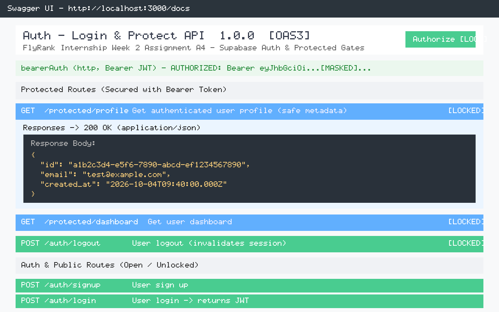

# Auth · Login & Protect API (FlyRank Internship — Assignment A4)

A secure, production-ready authentication and authorization backend built with **Node.js**, **Express**, and **Supabase Auth**. This project demonstrates end-to-end user authentication, JWT verification, reusable Express auth middleware, protected routes, secure session termination, and interactive Swagger UI documentation with Bearer token authorization.

---

## 🚀 Features

- **Open Auth System:** User sign-up and password login via Supabase Auth without storing or hashing passwords locally.
- **JWT Token Verification:** Validates Supabase JWT access tokens directly using `supabase.auth.getUser(token)` — no cryptography secrets hardcoded.
- **Reusable Auth Middleware:** Centralized `requireAuth` Express middleware protecting sensitive endpoints and populating `req.user`.
- **Public & Protected Route Architecture:** Open public gates vs. locked endpoints returning only safe user metadata (`id`, `email`, `created_at`).
- **Session Logout:** Invalidation of authenticated user sessions returning `204 No Content`.
- **Interactive Swagger UI:** OpenAPI 3.0 specification with `bearerAuth` security scheme and instant Try-it-Out capabilities at `/docs`.
- **Persistent SQLite Task Storage:** Retains complete task CRUD API with SQLite database persistence.

---

## 🛠️ Tech Stack

- **Runtime:** Node.js (v18+)
- **Framework:** Express 4.x
- **Authentication & Backend-as-a-Service:** Supabase Auth (`@supabase/supabase-js`)
- **Database:** SQLite via `better-sqlite3`
- **Documentation:** Swagger UI (`swagger-ui-express` & OpenAPI 3.0)
- **Configuration:** `dotenv`

---

## ⚙️ Environment Variables & Configuration

Create a `.env` file in the root directory by copying the provided `.env.example`:

```bash
cp .env.example .env
```

Configure the following variables in `.env`:

```env
SUPABASE_URL=https://your-project.supabase.co
SUPABASE_KEY=your_supabase_anon_key
PORT=3000
```

> [!IMPORTANT]
> - Never use or expose the Supabase `service_role` secret key. Only use the public `anon` key.
> - The `.env` file is excluded from Git via `.gitignore` to prevent leaking credentials.

---

## 📦 Installation & Quick Start

### 1. Install Dependencies
```bash
npm install
```

### 2. Run the Server
```bash
npm start
```

The API server will start on `http://localhost:3000`.

---

## 📖 API Reference

### Main Auth & Protected Endpoints

| Method | Endpoint | Description | Auth Required | Status Codes |
|---|---|---|:---:|---|
| `POST` | `/auth/signup` | Registers a new user with Supabase | No | `201 Created`, `400 Bad Request` |
| `POST` | `/auth/login` | Authenticates user; returns JWT `access_token` and `refresh_token` | No | `200 OK`, `400 Bad Request`, `401 Unauthorized` |
| `POST` | `/auth/logout` | Logs out user and invalidates current session | **Yes** (`Bearer JWT`) | `204 No Content`, `401 Unauthorized` |
| `GET` | `/protected/profile` | Returns authenticated user safe metadata (`id`, `email`, `created_at`) | **Yes** (`Bearer JWT`) | `200 OK`, `401 Unauthorized` |
| `GET` | `/protected/dashboard` | Secondary protected route demonstrating reusable middleware | **Yes** (`Bearer JWT`) | `200 OK`, `401 Unauthorized` |
| `GET` | `/public/info` | Public welcome information open to all visitors | No | `200 OK` |

### Task CRUD Endpoints (SQLite Persistent)

| Method | Endpoint | Description | Auth Required | Status Codes |
|---|---|---|:---:|---|
| `GET` | `/tasks` | Retrieve list of all tasks | No | `200 OK` |
| `GET` | `/tasks/:id` | Get single task by ID | No | `200 OK`, `404 Not Found` |
| `POST` | `/tasks` | Create a new task | No | `201 Created`, `400 Bad Request` |
| `PUT` | `/tasks/:id` | Update task title and/or done status | No | `200 OK`, `400 Bad Request`, `404 Not Found` |
| `DELETE` | `/tasks/:id` | Delete task by ID | No | `204 No Content`, `404 Not Found` |
| `GET` | `/health` | Server health check | No | `200 OK` |

---

## 🔒 Authentication & Protected Routes

Protected endpoints require the access token received upon login passed via the standard HTTP `Authorization` header:

```http
Authorization: Bearer <access_token>
```

### Error Responses
- **Missing or malformed Authorization header:**
  ```json
  {
    "error": "Access token required"
  }
  ```
- **Invalid, tampered, or expired JWT:**
  ```json
  {
    "error": "Invalid or expired token"
  }
  ```

---

## 📑 Swagger UI & Bearer Authorization

Interactive documentation is served at: **[http://localhost:3000/docs](http://localhost:3000/docs)**

### How to Authenticate in Swagger UI:
1. Open `http://localhost:3000/docs` in your browser.
2. Execute `POST /auth/login` to obtain an `access_token`.
3. Click the green **Authorize 🔓** button at the top right of the Swagger UI.
4. Paste your JWT access token into the `Value` field for `bearerAuth` (format: `<token>` or `Bearer <token>`).
5. Click **Authorize** and then **Close**.
6. All protected routes will now display a locked padlock icon 🔒 and can be tested directly via **Try it out**.

### Swagger UI Interface


---

## 🧪 Step-by-Step Reproduction Guide for Fresh Users

1. **Clone the Repository:**
   ```bash
   git clone https://github.com/Omverma713/be-01-todo-crud-api.git
   cd be-01-todo-crud-api
   ```
2. **Setup Environment:**
   ```bash
   cp .env.example .env
   # Add your Supabase project URL and anon public key in .env
   ```
3. **Install Dependencies & Start:**
   ```bash
   npm install
   npm start
   ```
4. **Sign Up & Log In:**
   ```bash
   # Sign up
   curl -X POST http://localhost:3000/auth/signup -H "Content-Type: application/json" -d "{\"email\":\"test@example.com\",\"password\":\"password123\"}"

   # Log in and extract access_token
   curl -X POST http://localhost:3000/auth/login -H "Content-Type: application/json" -d "{\"email\":\"test@example.com\",\"password\":\"password123\"}"
   ```
5. **Access Protected Route:**
   ```bash
   curl -H "Authorization: Bearer <ACCESS_TOKEN>" http://localhost:3000/protected/profile
   ```

---

## 📜 Commit History (Honest Stage Commits)

- `Stage 0: setup server and supabase client`
- `Stage 1: signup and login routes working`
- `Stage 2: public route and unverified protected route`
- `Stage 3: profile route token verification`
- `Stage 4: auth middleware and logout endpoint`
- `Stage 5: Swagger UI documentation with bearer auth`
- `Stage 6: publish to GitHub and write README`
