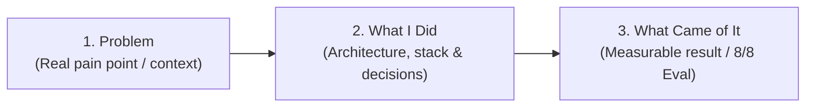

# Portfolio Continuity Guide: Adding the Next Case Study

This document outlines the exact process, structure, and content for adding the next case study to the personal portfolio website, maintaining visual and narrative continuity with the existing **HostelCare Backend** case study.

---

## 1. Where the Next Case Study Goes

The new case study will be placed directly in the **Projects / Case Studies** section of the portfolio, positioned immediately alongside the **HostelCare Backend** project. 

It will inherit the exact same visual design language, card layout, badge system, typography hierarchy, and concise engineering-focused tone.

---

## 2. The Three-Beat Case Study Structure (Week 2 Standard)

Every case study in the portfolio follows the proven three-beat narrative:

### Beat 1: Problem
- **Core Focus:** Describe the real-world operational or technical bottleneck that needed solving.
- **Tone:** Direct, empathetic, and problem-centric without technical jargon overload.
- **Example Angle:** Manual customer support triage causes misrouted tickets, delayed response times for urgent outages, and engineering distraction.

### Beat 2: What I Did
- **Core Focus:** Document what was engineered, the technical stack, architecture patterns, and critical production-readiness decisions.
- **Key Elements to Detail:**
  - REST endpoint design (`POST /triage`) and Zod schema contracts (input & output).
  - Versioned prompt management (`prompts/triage-v1.md`).
  - Self-healing parser with a single repair retry and quarantine logging (`logs/quarantine.jsonl`).
  - Production resilience: 30s timeout (`504`), exponential backoff with jitter on 429/5xx, and `Retry-After` adherence.
  - Operational observability: Token/latency telemetry logging, kill switch (`LLM_ENABLED=false`), and offline test stub (`LLM_STUB=1`).

### Beat 3: What Came of It
- **Core Focus:** Concrete, verifiable outcomes and metrics.
- **Key Results to Highlight:**
  - **100.0% Benchmark Accuracy (8/8 test cases passed)** across all categories and urgencies.
  - Sub-dollar operational costs (~$0.15–$0.35 per 10,000 requests / $0.00 on free tier).
  - High resilience: zero unhandled crashes or unformatted responses reaching clients.
  - Clean open-source repository on GitHub with complete documentation and reproduction steps.

---

## 3. Reusable Step-by-Step Checklist

Use this checklist whenever adding a new project to the portfolio:

- [ ] **1. Choose the completed project:** Select a verified, production-grade project with complete code, tests, and documentation.
- [ ] **2. Write the Problem section:** State the business or user problem clearly in 2–3 sentences.
- [ ] **3. Write the What I Did section:** Summarize the architecture, technologies, schema validation, and reliability mechanisms.
- [ ] **4. Write the What Came of It section:** Highlight quantifiable outcomes, benchmark scores, latency, and cost estimates.
- [ ] **5. Add measurable evidence/results:** Include test pass rates (e.g., 8/8 = 100%), telemetry log snippets, and UI screenshots.
- [ ] **6. Add relevant GitHub/demo links:** Provide direct links to the public GitHub repository and documentation.
- [ ] **7. Keep writing concise and consistent:** Match the tone, layout, and visual badges of the existing HostelCare case study.
- [ ] **8. Review before publishing:** Verify all markdown/HTML links, check mobile responsiveness, and confirm zero secrets/API keys are exposed.

---

## 4. Named Next Case Study: Support Ticket Triage API (A17)

### Project Overview
- **Project Name:** Support Ticket Triage API (`POST /triage`)
- **Category:** Backend Engineering / Production AI Integration
- **GitHub Repository:** [https://github.com/Omverma713/be-01-todo-crud-api](https://github.com/Omverma713/be-01-todo-crud-api)

### Purpose & Problem Solved
Support desks receive high volumes of unstructured, messy user messages. This API provides automated, deterministic triage—classifying tickets into closed categories (`billing`, `bug`, `feature`, `other`), assigning urgency (`low`, `normal`, `high`), estimating confidence (`0.0`–`1.0`), and providing a concise rationale.

### Implementation Highlights
- **Stack:** Node.js 20+, Express, OpenAI SDK (`openai`), OpenRouter (`openrouter/free`), Zod.
- **Contract Enforcement:** Strict pre-invocation input validation (1–2000 chars) returning `400 Bad Request` on invalid payload.
- **Prompt Engineering:** Versioned prompt template stored at `prompts/triage-v1.md`.
- **Self-Healing & Quarantine:** Strips markdown fences, parses JSON, executes 1 targeted repair retry upon schema mismatch, and quarantines irrecoverable errors to `logs/quarantine.jsonl` returning `422 Unprocessable Entity`.
- **Production Reliability:** 30s timeout, exponential backoff (1s, 2s, 4s) + jitter on rate-limits/5xx, cost/token telemetry tracking, and kill switch (`LLM_ENABLED=false`).

### Evaluation & Outcome
- **Benchmark Score:** **8/8 = 100.0%** passing on standard evaluation suite (`evals/run-eval.js` & `evals/cases.json`).
- **Evaluation Date:** 2026-10-04
- **Prompt Version:** `triage-v1`
- **Cost Efficiency:** ~$0.15–$0.35 per 10,000 daily requests.

### Why This Is Suitable as the Next Portfolio Case Study
It demonstrates modern backend AI engineering—showing how to safely integrate LLMs into web services with strict validation, resilience patterns, cost awareness, automated evaluation, and fallback protections rather than building fragile prototypes.

---

## 5. Reminder for Portfolio Update

A reminder has been prepared to ensure timely addition of this case study:

- **Reminder Title:** `Add Support Ticket Triage API case study to portfolio`
- **Scheduled Date & Time:** `October 11, 2026, 10:00 AM IST`
- **Reminder Details:** Add the Support Ticket Triage API (A17) case study to the portfolio project section using the three-beat structure (Problem → What I Did → What Came of It), linking to `https://github.com/Omverma713/be-01-todo-crud-api` with the verified 8/8 (100%) evaluation result.

---

## 6. Build Context Preserved

> [!IMPORTANT]
> **Do NOT delete, recreate, or reset the existing Claude Project.**
> 
> The existing Claude Project contains:
> 1. **Portfolio Voice & Identity Kit:** Established tone, personal bio, design preferences, and styling conventions.
> 2. **Previous Case Study Context:** The structure and copy of the existing **HostelCare Backend** case study.
> 3. **Tech Stack & Architecture Standards:** Established styling rules (CSS/Tailwind/HTML) and component patterns.
>
> All future portfolio updates should continue directly within the existing Claude Project to maintain brand continuity and avoid context loss.
